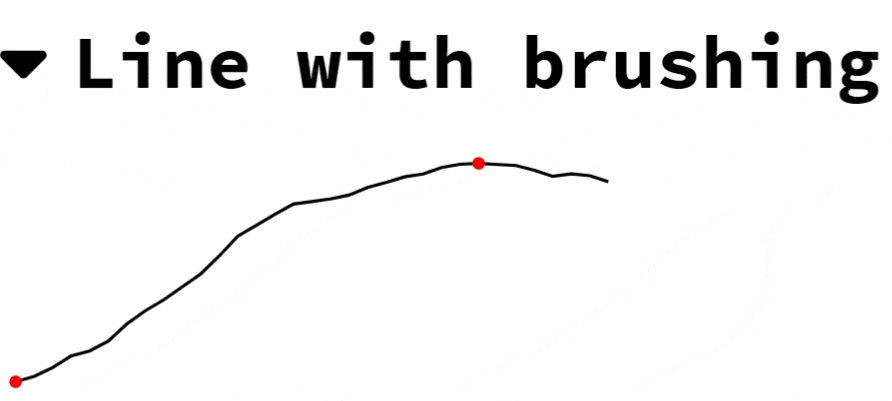
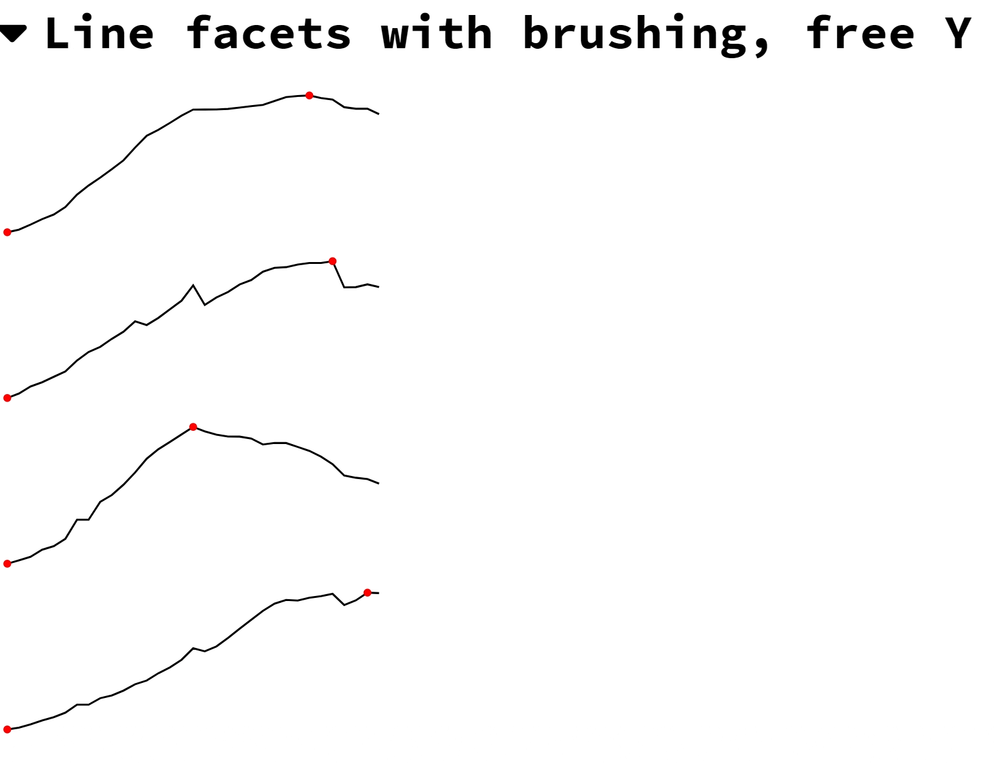

# elm-sparklines

Line and columns sparklines charts with optional interactive brushing 
(selection and labelling).





## Getting started

Install from your elm project:

```
$ elm install ericgj/elm-sparklines
```

For color configuration, you will also need to install 
`elm-community/typed-svg`, and use `TypedSvg.Types.Paint`.

For brushing, you will need to install `gampleman/elm-visualization`, and 
create and maintain a brush in your model as described in the
[documentation](https://package.elm-lang.org/packages/gampleman/elm-visualization/latest/Brush).

The Example/Brush and Main example modules show how to do this.


